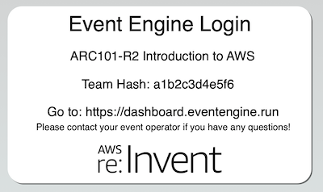
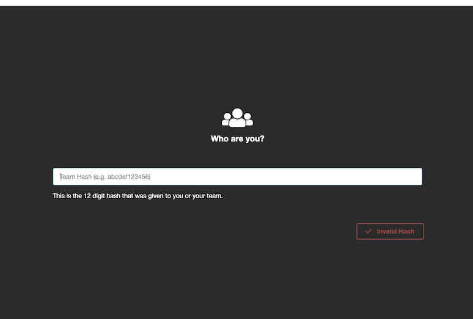
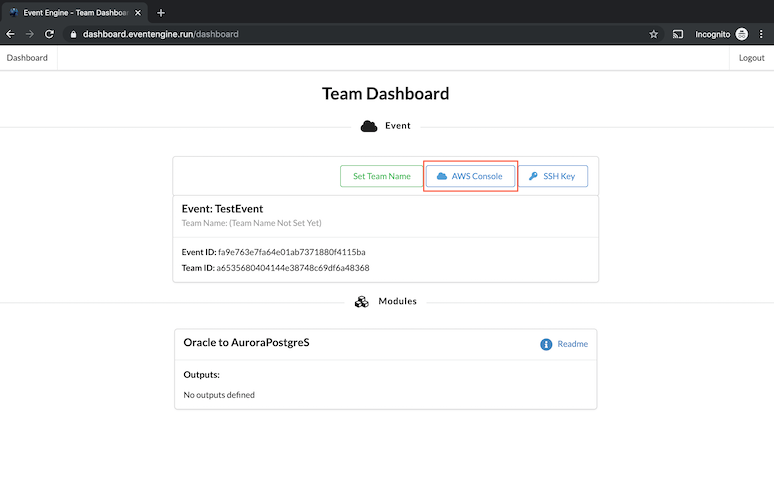
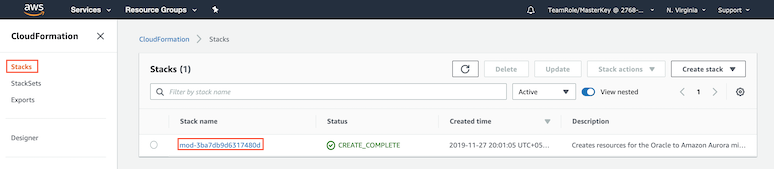
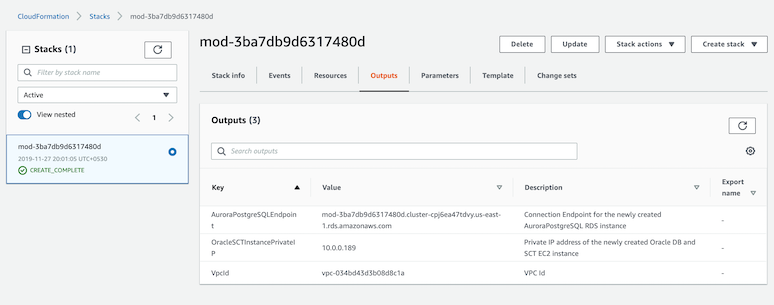

[Back to main guide](../README.md)|[Next](sct.md)

___

# Login to Event Engine
Event Engine provides you an AWS environment for running this workshop.  

1. You will be given a hash code to log-in to Event Engine. Refer to the following image for a sample hash code. 

2. Navigate to [dashboard.eventengine.run](https://dashboard.eventengine.run/dashboard) and enter your hash code.

3. Click on the **AWS console** button to log-in to AWS environment.

   
  
# CloudFormation Stack Outputs

The Event Engine runs the CloudFormation stack to set up following components in AWS:
- An EC2 instance with following components 
   - AWS Schema Conversion Tool (SCT)
   - Source Oracle database
   - Oracle SQL Developer
   - A sample web application 
- An Amazon Aurora PostgreSQL instance used as the target database

1. Go to the [AWS CloudFormation console](https://console.aws.amazon.com/cloudformation/home?region=us-east-1) and click on Stacks in the navigation panel to list CloudFormation Stacks. You should see a CloudFormation stack with name like  `mod-xxxxxxxxxxx`.

2. Click on the **Resources** tab. You will see various AWS resources created.

3. Make a note of the stack output parameters. You can find the stack output parameters in the **Outputs** tab. **You need these parameters later in the workshop.**

___

[Back to main guide](../README.md)|[Next](sct.md)