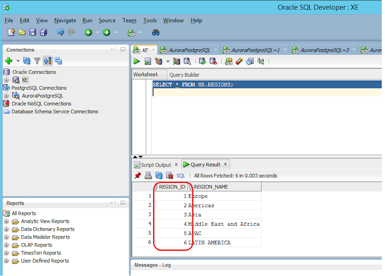
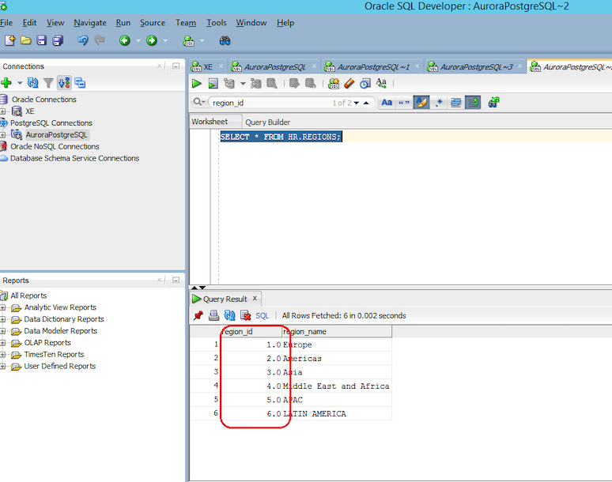
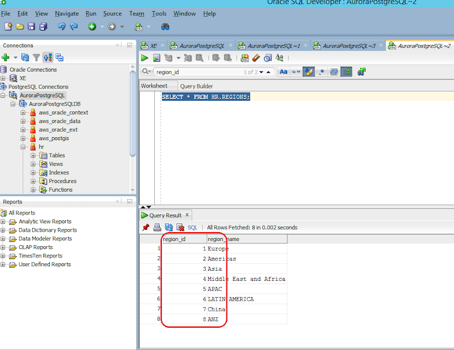

[Back to main guide](../README.md)|[Next](optional-resolv.md)
___

#  Fixing issues with numeric data types

In this section, we will fix possible issues while migrating numeric data types from Oracle to PostgreSQL. 

## Numeric Data Types

The NUMBER data type in Oracle is used to store numeric values. The NUMBER data type is defined as NUMBER (**p**, s). **p** is the precision (the total number of digits in the number) and s is the scale (the number of digits after the decimal point). For example, the number 123,456.789 has a precision of 9 and a scale of 3. You would define this data type as NUMBER (9, 3).


The equivalent datatype in PostgreSQL is **NUMERIC**. For example, you can define a datatype as **NUMERIC (9, 3)**. If a column is defined as **NUMBER (p, s)** in Oracle, i.e. with precision and scale specified, SCT will automatically map it to the equivalent **NUMERIC (p, s)** data type in PostgreSQL.  

## Numeric Data Types without precision and scale.

It is recommended to specify both precision and scale while defining numeric columns. However, it is not mandatory to specify the precision and scale for numeric data types; for example, you can define a column in Oracle as just **NUMBER**, without any precision and scale. If the precision and scale are not specified, the number is stored in the database as entered. 

If a column is defined as **NUMBER** in Oracle, **without** any precision and scale, SCT will map it to **DOUBLE PRECISION** in PostgreSQL. This is because SCT cannot identify the number of digits after the decimal point (the scale) if it is not specified in the column data type definition. The following table shows the data type mapping SCT uses in various scenarios.

Oracle Data Type | PostgreSQL Data Type
--- | ---
NUMBER(9,3)	 |	NUMERIC (9,3)	
NUMBER(9,0)	 |	NUMERIC (9,0)	
NUMBER | DOUBLE PRECISION

_Please refer to page 89 of the [Oracle to Aurora PostgreSQL migration playbook](https://d1.awsstatic.com/whitepapers/Migration/oracle-database-amazon-aurora-postgresql-migration-playbook.pdf) for a detailed discussion on Data Type mappings between Oracle and PostgreSQL._

## Issue with the data in the REGIONS table

In the REGIONS table in the Oracle source, the `region_id` column is defined as **NUMBER** without any precision and scale. SCT will map this to a **DOUBLE PRECISION** data type in PostgreSQL. 

After migrating the data using DMS, the values in the `region_id` column (in PostgreSQL) will appear as 1.0, 2.0 etc. You can verify this behavior by running `SELECT * FROM HR.REGIONS;` in both Oracle and Aurora PostgreSQL and comparing the output as shown in the following screenshots.

_The data from the REGIONS table in Oracle is shown in the following screenshot._




_The data from the REGIONS table in PostgreSQL is shown in the following screenshot. Note the ‘.0’ appended to the values in the ‘region_id’ column._




To fix this issue, we can modify the data type in the target Aurora PostgreSQL database from DOUBLE PRECISION to NUMERIC with a precision and scale. In this activity, we will modify the data type in the target Aurora PostgreSQL database to NUMERIC (6, 0).

_Note: The ‘emp_details_view’ depends on the ‘region_id’ column, you need to drop this view before making the data type change, and re-create the view again._ 

1.	Drop the `emp_details_view` view by running the following query while connected to the target **Aurora PostgreSQL** database.
```
DROP VIEW hr.emp_details_view;
COMMIT WORK;
```
	
2.	Modify the data type of the regions table (and the dependent COUNTRIES table) to         NUMERIC (6, 0) by running the following query. 

```
ALTER TABLE hr.countries
ALTER COLUMN region_id TYPE numeric(6,0);
ALTER TABLE hr.regions
ALTER COLUMN region_id TYPE numeric(6,0);
COMMIT WORK;
```

3.	Re-create the ‘emp_details_view’ view by running the following query. 

```

CREATE OR REPLACE VIEW hr.emp_details_view (employee_id, job_id, manager_id, department_id, location_id, country_id, first_name, last_name, salary, commission_pct, department_name, job_title, city, state_province, country_name, region_name) AS
SELECT
    e.employee_id, e.job_id, e.manager_id, e.department_id, d.location_id, l.country_id, e.first_name, e.last_name, e.salary, e.commission_pct, d.department_name, j.job_title, l.city, l.state_province, c.country_name, r.region_name
    FROM hr.employees AS e, hr.departments AS d, hr.jobs AS j, hr.locations AS l, hr.countries AS c, hr.regions AS r
    WHERE e.department_id = d.department_id AND d.location_id = l.location_id AND l.country_id = c.country_id AND c.region_id = r.region_id AND j.job_id = e.job_id;

```

4.	You can verify the issue is fixed by inserting two new rows into the REGIONS table in the source Oracle database by running the following query.

```

INSERT INTO HR.REGIONS VALUES (7,'China');
INSERT INTO HR.REGIONS VALUES (8,'ANZ');
COMMIT WORK;
```


5.	Now run ‘SELECT * from hr.regions;’ after connecting to the **Aurora PostgreSQL database** and verify that the data appears in the correct format as shown in the following screenshot.



___

[Back to main guide](../README.md)|[Next](optional-resolv.md)
