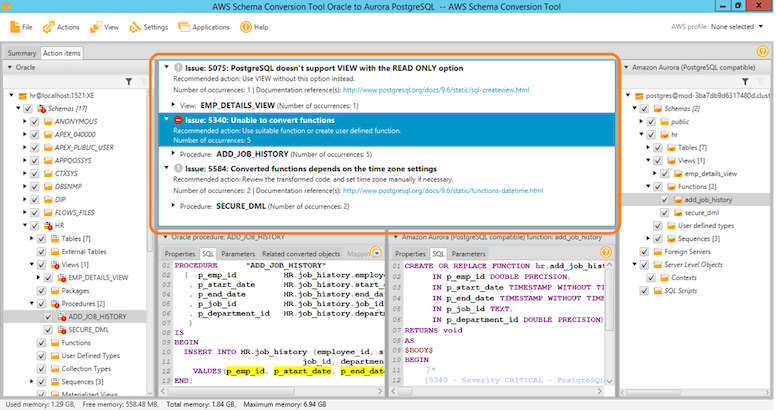
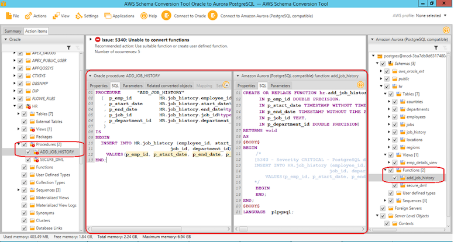

[Back to main guide](../README.md)|[Next](cleanup.md)

___

# Resolving SCT action items

In this section, we will look at the SCT assessment report, examine some of the warnings from SCT, and manually convert the schema objects that SCT was unable to convert.

_Note: If you have closed the SCT, please reopen the project in SCT (File-\&gt; Open Project from C:\Lab\SCT Projects\AWS Schema Conversion Tool Oracle to Aurora PostgreSQL)._

Right-click on the HR schema from the Oracle source, select &quot;Create Report&quot;, then click on &quot;Action items&quot;. You will see three items listed as shown in the following screenshot.



- EMP_DETAILS_VIEW view.
  - Issue 5075: PostgreSQL doesn&#39;t support VIEW with the READ ONLY option.
  - Schemas.HR.Views.EMP_DETAILS_VIEW: 555:568

PostgreSQL does not support read only views. SCT recommends that we use the view without the read only option and it has made the change automatically. No further action is needed from us.

- SECURE_DML procedure.
  - Issue 5584: Converted functions depends on the time zone settings
  - Schemas.HR.Procedures.SECURE_DML: 51:57
  - Schemas.HR.Procedures.SECURE_DML: 123:129

SCT recommends that we review the transformed code, and set time zone manually if necessary. No further action is needed from us.

- • ADD_JOB_HISTORY  procedure.
  - Issue 5340: Unable to convert functions.
  - Schemas.HR.Procedures.ADD_JOB_HISTORY: 441:448 
  - Schemas.HR.Procedures.ADD_JOB_HISTORY: 451:462 
  - Schemas.HR.Procedures.ADD_JOB_HISTORY: 465:474 
  - Schemas.HR.Procedures.ADD_JOB_HISTORY: 477:484 
  - Schemas.HR.Procedures.ADD_JOB_HISTORY: 487:501


We will have to manually convert this procedure. Please follow these steps to manually convert this procedure.

1. Click on the HR schema from the Oracle source, expand the procedures node, and select the &#39;ADD\_JOB\_HISTORY&#39; procedure. SCT will show you the side-by-side view of the original procedure in Oracle and the converted procedure in Aurora PostgreSQL as shown in the following screenshot.



2.  Examine the converted procedure in PostgreSQL on the right side. You will notice that SCT has provided details (as a comment) on the error while attempting to convert the procedure. This is highlighted in yellow below.

```
CREATE OR REPLACE FUNCTION hr.add_job_history(
     IN p_emp_id DOUBLE PRECISION, 
     IN p_start_date TIMESTAMP WITHOUT TIME ZONE, 
     IN p_end_date TIMESTAMP WITHOUT TIME ZONE, 
     IN p_job_id TEXT, 
     IN p_department_id DOUBLE PRECISION)
RETURNS void
AS
$BODY$
BEGIN
    /*
    [5340 - Severity CRITICAL - PostgreSQL doesn't support the ADD_JOB_HISTORY.P_EMP_ID function. Use suitable function or create user defined function., 5340 - Severity CRITICAL - PostgreSQL doesn't support the ADD_JOB_HISTORY.P_START_DATE function. Use suitable function or create user defined function., 5340 - Severity CRITICAL - PostgreSQL doesn't support the ADD_JOB_HISTORY.P_END_DATE function. Use suitable function or create user defined function., 5340 - Severity CRITICAL - PostgreSQL doesn't support the ADD_JOB_HISTORY.P_JOB_ID function. Use suitable function or create user defined function., 5340 - Severity CRITICAL - PostgreSQL doesn't support the ADD_JOB_HISTORY.P_DEPARTMENT_ID function. Use suitable function or create user defined function.]
    INSERT INTO HR.job_history (employee_id, start_date, end_date,
                               job_id, department_id)
        VALUES(p_emp_id, p_start_date, p_end_date, p_job_id, p_department_id)
    */
    BEGIN
    END;
END;
$BODY$
LANGUAGE  plpgsql;


```


3. In this case, the fix is simple. Copy the insert statement outside the comment, in between the BEGIN END block, and add a semicolon (;) to the end of the insert statement as shown below. The modified code is highlighted in yellow.
```
CREATE OR REPLACE FUNCTION hr.add_job_history(
     IN p_emp_id DOUBLE PRECISION, 
     IN p_start_date TIMESTAMP WITHOUT TIME ZONE, 
     IN p_end_date TIMESTAMP WITHOUT TIME ZONE, 
     IN p_job_id TEXT, 
     IN p_department_id DOUBLE PRECISION)
RETURNS void
AS
$BODY$
BEGIN
   /*
    [5340 - Severity CRITICAL - PostgreSQL doesn't support the ADD_JOB_HISTORY.P_EMP_ID function. Use suitable function or create user defined function., 5340 - Severity CRITICAL - PostgreSQL doesn't support the ADD_JOB_HISTORY.P_START_DATE function. Use suitable function or create user defined function., 5340 - Severity CRITICAL - PostgreSQL doesn't support the ADD_JOB_HISTORY.P_END_DATE function. Use suitable function or create user defined function., 5340 - Severity CRITICAL - PostgreSQL doesn't support the ADD_JOB_HISTORY.P_JOB_ID function. Use suitable function or create user defined function., 5340 - Severity CRITICAL - PostgreSQL doesn't support the ADD_JOB_HISTORY.P_DEPARTMENT_ID function. Use suitable function or create user defined function.]
    */
    BEGIN
    INSERT INTO HR.job_history (employee_id, start_date, end_date,
                               job_id, department_id)
        VALUES(p_emp_id, p_start_date, p_end_date, p_job_id, p_department_id);

    END;
END;
$BODY$
LANGUAGE  plpgsql;

```

4. Click on the HR schema from Aurora PostgreSQL target, expand the functions node, and select `add_job_history`&#39;`. Right click, select **Apply to database** and click yes when prompted. If the **Apply to database** menu is disabled, click Connect to Amazon Aurora(PostgreSQL compatible) on the top menu bar and try again. Now the manually converted procedure has been applied to the target database.

5. To view the modified procedure code in SQL developer, right click on the Aurora PostgreSQL connection, open a new SQL Worksheet, and run the following script (Click the run script button or press F5 on the keyboard).
```
SELECT
    pg_get_functiondef((
            SELECT
                oid FROM pg_proc
            WHERE
                proname = 'add_job_history'));
```


[Back to main guide](../README.md)|[Next](cleanup.md)